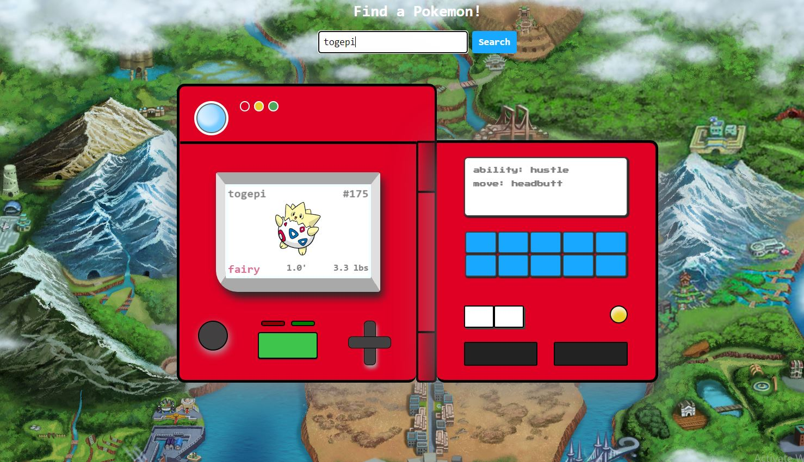

# Pokedex: Pokemon Finder
A Pokemon inspired Pokedex that allows you to search for a Pokemon and view facts about them, such as their number, type, height and weight.

**Link to project:** https://brookebytes.github.io/Pokedex

## How It's Made:

**Tech used:** HTML, CSS, JavaScript

This project mostly consists of CSS as this makes up the styling of the ‘Pokedex’. The data is fetched and processed using JavaScript which calls on the PokeAPI. 

## Lessons Learned:

I started this project to challenge myself to make a design out of CSS. I learned more about using CSS to make a webpage more unique and fun, while remaining responsive and intentional. 
